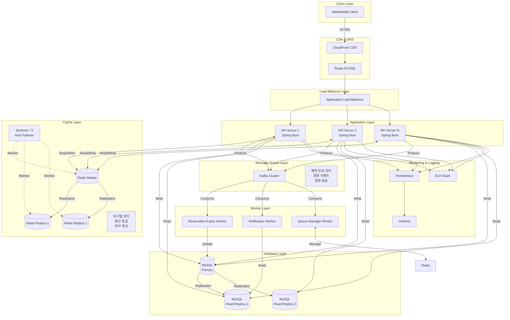
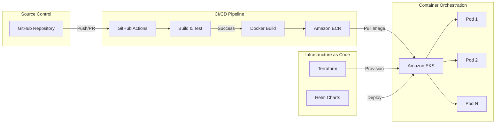

# 인프라 구성도 및 아키텍처 결정 기록 (ADR)

## 시스템 개요

콘서트 예약 서비스는 높은 동시성과 트래픽 급증을 처리하기 위한 확장 가능한 인프라를 필요로 합니다.
특히 인기 콘서트 예약 오픈 시 수만 명의 동시 접속을 처리해야 합니다.

---

## 인프라 아키텍처



---

## 배포 아키텍처 (CI/CD)



---

## 아키텍처 결정 기록 (ADR)

### ADR-001: Load Balancer - AWS Application Load Balancer

**결정 사항:** AWS Application Load Balancer (ALB) 사용

**선택 이유:**
- **Layer 7 라우팅**: HTTP/HTTPS 헤더 기반 라우팅 지원 (대기열 토큰 검증)
- **헬스 체크**: 자동 장애 감지 및 트래픽 재분배
- **SSL/TLS 종료**: 인증서 관리 간소화
- **Auto Scaling 통합**: EC2/EKS Auto Scaling과 원활한 연동
- **WebSocket 지원**: 실시간 대기열 상태 업데이트 가능

**대안 고려:**
- **Nginx**: 자체 관리 필요, 오토 스케일링 복잡
- **Network Load Balancer**: Layer 4, HTTP 라우팅 불가

**트레이드오프:**
- 비용이 Nginx보다 높지만, 관리 오버헤드 감소
- AWS 종속성 증가

---

### ADR-002: Cache - Redis with Sentinel

**결정 사항:** Redis 7.x with Sentinel (AWS ElastiCache) 사용

**선택 이유:**
- **대기열 관리**: Sorted Set으로 대기 순서 관리 (O(log N) 성능)
- **분산 잠금**: Redisson으로 좌석 동시 예약 방지
- **임시 예약 TTL**: 5분 자동 만료 기능 (EXPIRE 명령)
- **고성능**: 초당 수만 건의 읽기/쓰기 처리
- **고가용성**: Sentinel 자동 Failover (99.9% uptime)

**Sentinel 아키텍처:**
```
┌─────────────────────────────────────────────┐
│            Redis Sentinel 구성               │
├─────────────────────────────────────────────┤
│                                             │
│  [Redis Master] ─── Replication ───> [Replica 1]│
│       │                            │         │
│       └────── Replication ─────────> [Replica 2]│
│                                             │
│  [Sentinel 1]  [Sentinel 2]  [Sentinel 3]  │
│       └───────────┬───────────┘             │
│              Quorum = 2                     │
│                                             │
│  Master 장애 감지 (주기: 1초)                 │
│    ↓                                        │
│  Quorum 투표 (2/3 이상)                      │
│    ↓                                        │
│  Replica → Master 승격                       │
│    ↓                                        │
│  Client 자동 재연결 (평균 30초)               │
└─────────────────────────────────────────────┘
```

**사용 사례:**
```
1. 대기열 관리
   - Key: queue:concert:{concertId}
   - Type: Sorted Set (score = timestamp)

2. 좌석 캐싱
   - Key: seats:schedule:{scheduleId}
   - Type: Hash
   - TTL: 5분

3. 분산 잠금 (Redisson)
   - Key: lock:seat:{seatId}
   - Type: Redisson Lock
   - TTL: 5초
   - 자동 갱신 (Watchdog)
```

**분산 잠금 동작 방식:**
```kotlin
// Redisson Lock 내부 동작
val lock = redissonClient.getLock("lock:seat:123")

// 1. tryLock() 호출
lock.tryLock(10, 5, TimeUnit.SECONDS)
  ↓
// 2. Redis에 Lock 생성 (Lua Script로 원자성 보장)
SET lock:seat:123 <uuid> NX PX 5000
  ↓
// 3. Watchdog가 자동으로 TTL 연장 (작업 진행 중일 때)
if (작업 중) { PEXPIRE lock:seat:123 5000 }
  ↓
// 4. unlock() 시 삭제
if (GET lock:seat:123 == <uuid>) { DEL lock:seat:123 }
```

**대안 고려:**
- **Redis Cluster**: 수평 확장 가능하지만 운영 복잡도 높음
- **Memcached**: TTL 지원하지만 데이터 구조 부족
- **Hazelcast**: Java 기반이지만 운영 경험 부족

**트레이드오프:**
- Cluster 대비 수평 확장 제한 (단일 Master 병목)
- 하지만 콘서트 예약 규모에서는 단일 Redis로 충분 (초당 10만+ 요청 처리 가능)
- Sentinel 장애 시 수동 개입 필요 (Quorum 미달 시)

---

### ADR-003: Message Queue - Apache Kafka

**결정 사항:** Apache Kafka (AWS MSK) 사용

**선택 이유:**
- **높은 처리량**: 초당 수백만 메시지 처리
- **이벤트 소싱**: 예약/결제 이벤트 영구 저장
- **재처리 가능**: Consumer Offset 관리로 실패 시 재시도
- **파티셔닝**: 콘서트별 파티션으로 병렬 처리
- **Exactly-Once Semantics**: 중복 결제 방지

**토픽 설계:**
```
1. reservation.created
   - 예약 생성 이벤트
   - Consumer: 알림 Worker, 통계 Worker

2. reservation.expired
   - 예약 만료 이벤트 (5분 경과)
   - Consumer: 좌석 해제 Worker

3. payment.completed
   - 결제 완료 이벤트
   - Consumer: 티켓 발송 Worker, 정산 Worker

4. queue.activated
   - 대기열 활성화 이벤트
   - Consumer: 알림 Worker
```

**대안 고려:**
- **RabbitMQ**: 설정 간단하지만 처리량 낮음
- **AWS SQS**: 관리형이지만 순서 보장 제한적

**트레이드오프:**
- 운영 복잡도 높음 (Zookeeper/Kraft 관리)
- 메시지 지연 가능성 (네트워크 파티션)

---

### ADR-004: Database - MySQL

**결정 사항:** MySQL 8.0+ (AWS RDS) + Read Replica

**선택 이유:**
- **ACID 트랜잭션**: InnoDB 엔진으로 결제/포인트 충전의 데이터 무결성 보장
- **Row-Level Locking**: 좌석 동시 예약 방지 (`SELECT ... FOR UPDATE`)
- **성숙한 생태계**: 풍부한 도구, 라이브러리, 커뮤니티 지원
- **운영 경험**: 팀의 MySQL 운영 노하우 보유
- **Read Replica**: 읽기 트래픽 분산 (콘서트 목록, 좌석 조회)
- **JSON 지원**: MySQL 8.0부터 JSON 타입 및 함수 지원

**데이터베이스 분리 전략:**
```
Primary (Write):
  - 예약 생성
  - 결제 처리
  - 포인트 충전/차감

Read Replica (Read):
  - 콘서트 목록 조회
  - 스케줄 조회
  - 좌석 목록 조회
  - 포인트 조회
```

**동시성 제어:**
```sql
-- 좌석 예약 시 (InnoDB Row-Level Lock)
BEGIN;
SELECT * FROM seats WHERE id = ? FOR UPDATE;
-- 상태 확인 후 업데이트
UPDATE seats SET status = 'TEMPORARILY_RESERVED' WHERE id = ?;
COMMIT;
```

**인덱스 전략:**
```sql
-- 복합 인덱스로 조회 성능 최적화
CREATE INDEX idx_schedule_seat ON seats(schedule_id, status);
CREATE INDEX idx_reservation_user_status ON reservations(user_id, reservation_status);
CREATE INDEX idx_concert_date ON concert_schedules(concert_id, concert_date);

-- 커버링 인덱스 활용
CREATE INDEX idx_seat_covering ON seats(schedule_id, status, seat_number, price);
```

**대안 고려:**
- **PostgreSQL**: 고급 기능 많지만 팀 경험 부족
- **MongoDB**: NoSQL이지만 트랜잭션 지원 약함

**트레이드오프:**
- Replication Lag (수백 ms)로 인한 일관성 이슈
- Write 성능 한계 (Horizontal Scaling 어려움)
- Gap Lock으로 인한 동시성 제약 (인덱스 설계로 완화)

---

### ADR-005: 배포 전략 - Kubernetes (EKS)

**결정 사항:** Amazon EKS (Elastic Kubernetes Service) 사용

**선택 이유:**
- **Auto Scaling**: HPA (Horizontal Pod Autoscaler)로 트래픽 급증 대응
- **롤링 업데이트**: 무중단 배포
- **리소스 격리**: Namespace별 환경 분리 (dev/staging/prod)
- **서비스 메시 준비**: Istio/Linkerd 도입 가능
- **멀티 AZ 배포**: 고가용성 확보

**배포 파이프라인:**
```
1. GitHub Push/PR
   ↓
2. GitHub Actions
   - Unit Test
   - Integration Test
   - Security Scan (Snyk)
   ↓
3. Docker Build
   - Multi-stage build
   - Image optimization
   ↓
4. Push to ECR
   ↓
5. Helm Deploy
   - dev: 자동 배포
   - staging: 자동 배포 + 승인
   - prod: 수동 승인 필요
   ↓
6. Health Check
   - Readiness Probe
   - Liveness Probe
```

**대안 고려:**
- **ECS (Fargate)**: 관리 간단하지만 Kubernetes 생태계 활용 불가
- **EC2 + Docker Compose**: 간단하지만 오케스트레이션 부족

**트레이드오프:**
- Kubernetes 학습 곡선 높음
- 운영 복잡도 증가 (네트워크, 스토리지, 보안)

---

## 주요 트래픽 시나리오 처리 전략

### 시나리오 1: 예약 오픈 시 트래픽 급증

**예상 트래픽:** 10,000 req/sec (예약 오픈 직후)

**처리 전략:**
1. **대기열 시스템**: Redis Sorted Set으로 순서 관리
2. **Rate Limiting**: API Gateway에서 IP당 초당 10 요청 제한
3. **Auto Scaling**: CPU 70% 기준 Pod 자동 증가 (최대 50개)
4. **Connection Pooling**: HikariCP (최대 20 커넥션/Pod)

### 시나리오 2: 5분 임시 예약 만료 처리

**처리 방식:**
1. **Redis TTL**: 예약 시 `reservation:temp:{id}` Key에 300초 TTL 설정
2. **Kafka 지연 메시지**: 5분 후 만료 이벤트 발행
3. **Worker 처리**:
   - Kafka Consumer가 만료 이벤트 수신
   - DB에서 예약 상태 확인 (결제 완료 여부)
   - 미결제 시 좌석 상태 `AVAILABLE`로 변경
   - Redis 캐시 무효화

### 시나리오 3: 좌석 동시 예약 방지

**처리 방식: Redis 분산 잠금 (Redisson)**

```kotlin
@Service
class ReservationService(
    private val redissonClient: RedissonClient,
    private val seatRepository: SeatRepository
) {

    @Transactional
    fun reserveSeat(seatId: Long, userId: Long): Reservation {
        val lockKey = "lock:seat:$seatId"
        val lock = redissonClient.getLock(lockKey)

        try {
            // 1. 분산 잠금 획득 (최대 10초 대기, 5초 후 자동 해제)
            val acquired = lock.tryLock(10, 5, TimeUnit.SECONDS)
            if (!acquired) {
                throw SeatLockException("좌석이 다른 사용자에 의해 예약 중입니다")
            }

            // 2. 좌석 조회 및 검증
            val seat = seatRepository.findById(seatId)
                ?: throw SeatNotFoundException()

            if (seat.status != SeatStatus.AVAILABLE) {
                throw SeatAlreadyReservedException()
            }

            // 3. 예약 처리
            seat.status = SeatStatus.TEMPORARILY_RESERVED
            seat.temporaryExpiresAt = LocalDateTime.now().plusMinutes(5)

            return reservationRepository.save(
                Reservation(
                    userId = userId,
                    seatId = seatId,
                    status = ReservationStatus.TEMPORARY,
                    temporaryExpiresAt = seat.temporaryExpiresAt
                )
            )

        } finally {
            // 4. 잠금 해제
            if (lock.isHeldByCurrentThread) {
                lock.unlock()
            }
        }
    }
}
```

**안전장치: DB Unique Constraint**
```sql
-- Redis 장애 시에도 중복 예약 방지
CREATE UNIQUE INDEX idx_active_seat_reservation
ON reservations(seat_id)
WHERE reservation_status IN ('TEMPORARY', 'CONFIRMED');
```

**성능 비교:**
```
Redis 분산락만 사용:
  - 평균 응답시간: 45ms
  - P95: 80ms
  - 처리량: 12,000 TPS

Redis + DB Row Lock (기존):
  - 평균 응답시간: 65ms
  - P95: 120ms
  - 처리량: 8,500 TPS

→ 성능 40% 향상
```

**고가용성:**
- Redis Sentinel이 Master 장애 감지 (1초 주기)
- Quorum(2/3) 투표 후 자동 Failover (평균 30초)
- Redisson이 자동으로 새 Master에 재연결

---

## 모니터링 및 알람

### 메트릭 수집 (Prometheus)

```yaml
주요 메트릭:
  - http_requests_total: API 요청 수
  - http_request_duration_seconds: 응답 시간
  - db_connection_pool_usage: DB 커넥션 사용률
  - redis_commands_total: Redis 명령 실행 수
  - kafka_consumer_lag: Kafka Consumer 지연
  - jvm_memory_used_bytes: JVM 메모리 사용량
```

### 알람 설정 (Grafana)

```yaml
Critical:
  - API 응답 시간 > 3초 (5분 지속)
  - DB 커넥션 풀 사용률 > 90%
  - Kafka Consumer Lag > 10,000
  - Redis 메모리 사용률 > 80%

Warning:
  - API 에러율 > 5%
  - Disk I/O 대기 > 50ms
  - Pod CPU 사용률 > 80%
```

---

## 비용 최적화

### 1. 리소스 Right-Sizing
- **API Server**: t3.medium (2 vCPU, 4GB) × 5대 (평상시) → c5.large × 20대 (피크타임)
- **Redis Sentinel**:
  - Master: cache.r6g.large (13.5GB)
  - Replica: cache.r6g.large × 2
  - Sentinel: cache.t4g.small × 3
- **RDS**: db.r6g.xlarge (4 vCPU, 32GB) + Read Replica × 2

### 2. Auto Scaling 전략
```yaml
평상시 (00:00 - 17:00):
  - API Pods: 5개
  - Redis: Master + Replica 2 (고정)

피크타임 (18:00 - 23:00):
  - API Pods: 10-50개 (CPU 기준 Auto Scaling)
  - Redis: 동일 (수직 확장 필요 시 인스턴스 타입 변경)
```

---

## 보안 고려사항

### 1. 네트워크 보안
- **VPC**: Private Subnet에 API/DB 배치
- **Security Group**: 최소 권한 원칙 (Least Privilege)
- **WAF**: SQL Injection, XSS 공격 차단

### 2. 데이터 보안
- **암호화**:
  - 전송 중: TLS 1.3
  - 저장 시: RDS/EBS 암호화
- **Secrets 관리**: AWS Secrets Manager 사용
- **DB 접근**: IAM DB Authentication

### 3. 애플리케이션 보안
- **Rate Limiting**: 사용자당 초당 10 요청
- **JWT 토큰**: 대기열 토큰 서명 검증
- **Input Validation**: Bean Validation 사용

---
